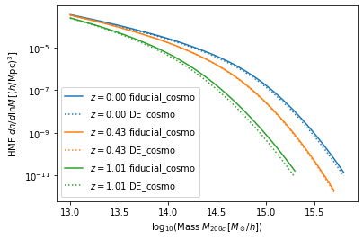
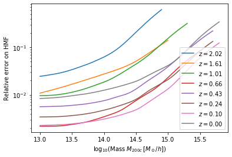
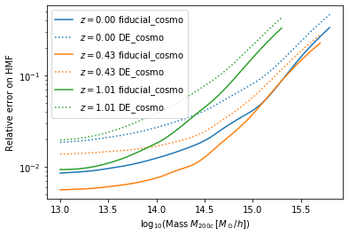
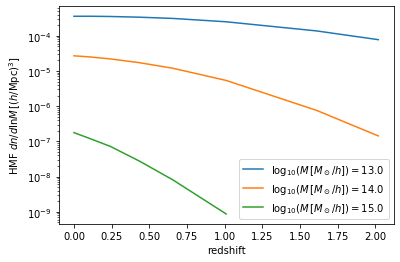

Tutorial
========

Learn how to use the *Mira-Titan* HMF emulator.

.. code:: ipython3

    import numpy as np
    from matplotlib import pyplot as plt
    %matplotlib inline
    
    import MiraTitanHMFemulator
    
    print("Version", MiraTitanHMFemulator.__version__)

.. parsed-literal::

    Version 0.0.0

Initialize the emulator
-----------------------

This may take a few seconds: the code pre-computes a bunch of matrix
inversions (actually, Cholesky decompositions).

.. code:: ipython3

    HMFemu = MiraTitanHMFemulator.Emulator()

Input cosmology
---------------

Let’s define a set of cosmology parameter for which we want the HMF. In
case you are unsure about the parameters and their ranges, you can grab
that from the emulator instance we just created. Don’t worry, the
emulator will check that your cosmology is valid (see example
“Validation of input cosmology” below).

.. code:: ipython3

    HMFemu.param_limits

.. parsed-literal::

    {'Ommh2': (0.12, 0.155),
     'Ombh2': (0.0215, 0.0235),
     'Omnuh2': (0, 0.01),
     'n_s': (0.85, 1.05),
     'h': (0.55, 0.85),
     'sigma_8': (0.7, 0.9),
     'w_0': (-1.3, -0.7),
     'w_a': (-1.73, 1.28),
     'w_b': (0.3, 1.3)}

Note about dark energy equation-of-state parametrization
~~~~~~~~~~~~~~~~~~~~~~~~~~~~~~~~~~~~~~~~~~~~~~~~~~~~~~~~

The emulator itself works in the space of :math:`(w_0, w_b)`, where
:math:`w_b = (-w_0 -w_a)^{1/4}` (see paper). The user is expected to
provide the parameters in the usual space of :math:`(w_0, w_a)` and the
code will handle the conversion for you!

Note that the cosmology needs to satisfy all 9 parameter constraints,
not just 8 for the parameters you provided.

.. code:: ipython3

    fiducial_cosmo = {'Ommh2': .3*.7**2,
                      'Ombh2': .022,
                      'Omnuh2': .0006,
                      'n_s': .96,
                      'h': .7,
                      'w_0': -1,
                      'w_a': 0,
                      'sigma_8': .8,
                     }

Call the emulator
-----------------

It’s as easy as:

.. code:: ipython3

    res = HMFemu.predict(fiducial_cosmo)

Now let’s look at the output stored in the ``res`` dictionary. Each
(numerical) key corresponds to a redshift for which the emulator
computed the HMF. There’s a ``Units`` key, too.

.. code:: ipython3

    print(res.keys())

.. parsed-literal::

    dict_keys(['Units', 2.02, 1.61, 1.01, 0.656, 0.434, 0.242, 0.101, 0.0])

.. code:: ipython3

    print(res['Units'])

.. parsed-literal::

    log10_M is log10(Mass in [Msun/h]), HMFs are given in dn/dlnM [(h/Mpc)^3]

So far, nothing too surprising. Now let’s look into one of the redshift
outputs:

.. code:: ipython3

    print("Keys of res[0.0]:\t", res[0.0].keys())
    print("Redshift of res[0.0]:\t", res[0.0]['redshift'])
    print("Array of (log) masses:\t", res[0.0]['log10_M'])
    print("The emulated HMF\t", res[0.0]['HMF'])

.. parsed-literal::

    Keys of res[0.0]:	 dict_keys(['redshift', 'log10_M', 'HMF'])
    Redshift of res[0.0]:	 0.0
    Array of (log) masses:	 [13.    13.001 13.002 ... 15.797 15.798 15.799]
    The emulated HMF	 [3.58038023e-04 3.57227447e-04 3.56418706e-04 ... 1.44019868e-11
     1.41831239e-11 1.39674654e-11]

This cries for a nice plot. Note that the emulator covers the HMF down
to about 1e-12, which corresponds to different masses at different
redshifts.

.. code:: ipython3

    for z in HMFemu.z_arr:
        plt.semilogy(res[z]['log10_M'], res[z]['HMF'], label='$z=%.2f$'%z)
    plt.xlabel('$\log_{10}$(Mass $M_{200c}\,[M_\odot/h]$)')
    plt.ylabel('HMF $dn/d\lnM\,[(h/\\mathrm{Mpc})^3]$')
    plt.legend();

.. image:: _static/tutorial_files/tutorial_16_0.png

OK, now we understand the basic concept. Let’s try another cosmology
with for dark energy just for fun.

.. code:: ipython3

    DE_cosmo = {'Ommh2': .3*.7**2,
                'Ombh2': .022,
                'Omnuh2': .0006,
                'n_s': .96,
                'h': .7,
                'w_0': -1.3,
                'w_a': -1,
                'sigma_8': .8,
               }

.. code:: ipython3

    res_DE = HMFemu.predict(DE_cosmo)

.. code:: ipython3

    colors=['C%s'%i for i in range(3)]
    for i,z in enumerate([0.0, 0.434, 1.01]):
        plt.semilogy(res[z]['log10_M'], res[z]['HMF'], color=colors[i], label='$z=%.2f$ fiducial_cosmo'%z)
        plt.semilogy(res[z]['log10_M'], res_DE[z]['HMF'], color=colors[i], label='$z=%.2f$ DE_cosmo'%z, ls=':')
    plt.xlabel('$\log_{10}$(Mass $M_{200c}\,[M_\odot/h]$)')
    plt.ylabel('HMF $dn/d\lnM\,[(h/\\mathrm{Mpc})^3]$')
    plt.legend();

Validation of input cosmology
-----------------------------

As mentioned earlier, the emulator validates your input cosmology. For
example, if you miss one parameter, you get:

.. code:: ipython3

    bad_cosmo = {'Ommh2': .3*.7**2,
                 'Ombh2': .022,
                 'Omnuh2': .0006,
                 'n_s': .96,
                 'h': .7,
                 'w_0': -1,
                 'w_a': 0,
    #              'sigma_8': .8,
                }
    
    try:
        HMFemu.predict(bad_cosmo)
    except Exception as e:
        print(repr(e))

.. parsed-literal::

    KeyError('You did not provide sigma_8',)

Or if you set a parameter outside the range:

.. code:: ipython3

    bad_cosmo = {'Ommh2': .3*.7**2,
                 'Ombh2': .022,
                 'Omnuh2': .0006,
                 'n_s': .96,
                 'h': .7,
                 'w_0': -1,
                 'w_a': 0,
                 'sigma_8': 1.8,
                }
    
    try:
        HMFemu.predict(bad_cosmo)
    except Exception as e:
        print(repr(e))

.. parsed-literal::

    ValueError('Parameter sigma_8 is 1.8000 but must be <= 0.9000',)

If you don’t want the emulator to raise an exception, for example
because you are running an MCMC chain, you can also validate your input
cosmology before calling the emulator:

.. code:: ipython3

    is_valid = HMFemu.validate_params(bad_cosmo)
    print("Input cosmology 'bad_cosmo' is valid: %s"%is_valid)

.. parsed-literal::

    Input cosmology 'bad_cosmo' is valid: False

.. code:: ipython3

    is_valid = HMFemu.validate_params(fiducial_cosmo)
    print("Input cosmology 'fiducial_cosmo' is valid: %s"%is_valid)

.. parsed-literal::

    Input cosmology 'fiducial_cosmo' is valid: True

Emulator uncertainty
--------------------

Now let’s look at the built-in error estimate on the emulated HMF. Set
``N_draw`` to some reasonably large number such that the sample size is
large enough to allow for robust error estimates. The output dictionary
now has additional keys ``HMF_mean`` and ``HMF_std``.

.. code:: ipython3

    res_w_err = HMFemu.predict(fiducial_cosmo, N_draw=1000)
    print(res_w_err[0.0].keys())

.. parsed-literal::

    dict_keys(['redshift', 'log10_M', 'HMF', 'HMF_mean', 'HMF_std'])

Let’s visualize the error on the emulated HMF. As expected, the noise
increases with mass and redshift, because the input HMFs are limited by
shot noise in the halo catalogs.

.. code:: ipython3

    for i,z in enumerate(HMFemu.z_arr):
        plt.semilogy(res[z]['log10_M'], res_w_err[z]['HMF_std'], color='C%d'%i, label='$z=%.2f$'%z)
    plt.xlabel('$\log_{10}$(Mass $M_{200c}\,[M_\odot/h]$)')
    plt.ylabel('Relative error on HMF')
    plt.legend(loc='lower right');

Also note that the emulator precision depends on the location in
parameter space: If an input model is “close”, the error is smaller than
if the closest input cosmology is “far away”. So let’s compare the
errors on the fiducial cosmology and the “dark energy” model:

.. code:: ipython3

    res_DES_w_err = HMFemu.predict(DE_cosmo, N_draw=1000)

.. code:: ipython3

    for i,z in enumerate([0.0, 0.434, 1.01]):
        plt.semilogy(res_w_err[z]['log10_M'], res_w_err[z]['HMF_std'],
                     color=colors[i], label='$z=%.2f$ fiducial_cosmo'%z)
        plt.semilogy(res_DES_w_err[z]['log10_M'], res_DES_w_err[z]['HMF_std'],
                     ls=':', color=colors[i], label='$z=%.2f$ DE_cosmo'%z)
    plt.xlabel('$\log_{10}$(Mass $M_{200c}\,[M_\odot/h]$)')
    plt.ylabel('Relative error on HMF')
    plt.legend();

Redshift evolution
==================

The emulator provides the HMF for 8 discrete redshifts. If you need the
HMF at some intermediate redshift, we recommend you simply interpolate.
Let’s look at the evolution of the HMF with redshift at fixed mass.

.. code:: ipython3

    for m in [0, 1000]:
        plt.semilogy(HMFemu.z_arr, [res[z]['HMF'][m] for z in HMFemu.z_arr],
                     label='$\log_{10}(M\,[M_\odot/h])=%.1f$'%res[0.0]['log10_M'][m])
    m = 2000
    plt.semilogy(HMFemu.z_arr[2:], [res[z]['HMF'][m] for z in HMFemu.z_arr[2:]],
                 label='$\log_{10}(M\,[M_\odot/h])=%.1f$'%res[0.0]['log10_M'][m],
                )
    
    plt.xlabel('redshift')
    plt.ylabel('HMF $dn/d\lnM\,[(h/\\mathrm{Mpc})^3]$')
    plt.legend();

That’s it!
==========

You now know how to use the *Mira-Titan* HMF emulator. Please don’t
hesitate to share your feedback!

