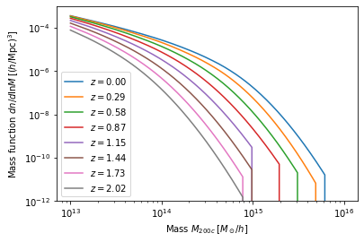
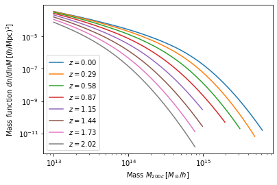
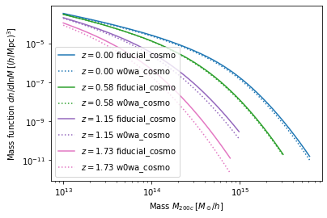
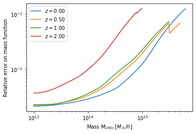
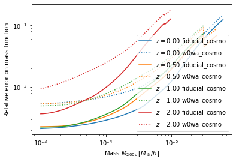

Tutorial
========

Learn how to use the *Mira-Titan* emulator for the halo mass function.
This tutorial is built from a jupyter notebook hosted on the
`MiraTitanHMFemulator GitHub
repository <https://github.com/SebastianBocquet/MiraTitanHMFemulator/blob/master/tutorial.ipynb>`__.

.. code:: ipython3

    import numpy as np
    from matplotlib import pyplot as plt
    %matplotlib inline
    
    import MiraTitanHMFemulator
    
    print("Version", MiraTitanHMFemulator.__version__)

.. parsed-literal::

    Version 0.1.0

Initialize the emulator
-----------------------

This may take a few seconds: the code pre-computes a bunch of matrix
inversions (actually, Cholesky decompositions).

.. code:: ipython3

    HMFemu = MiraTitanHMFemulator.Emulator()

Input cosmology
---------------

Let’s define a set of cosmology parameter for which we want the mass
function. In case you are unsure about the parameters and their ranges,
you can grab that from the emulator instance we just created. Don’t
worry, the emulator will check that your cosmology is valid (see example
“Validation of input cosmology” below).

Note about dark energy equation-of-state parametrization
~~~~~~~~~~~~~~~~~~~~~~~~~~~~~~~~~~~~~~~~~~~~~~~~~~~~~~~~

The emulator itself works in the space of :math:`(w_0, w_b)`, where
:math:`w_b = (-w_0 -w_a)^{1/4}` (see paper). The user is expected to
provide the parameters in the usual space of :math:`(w_0, w_a)` and the
code will handle the conversion for you.

.. code:: ipython3

    HMFemu.param_limits

.. parsed-literal::

    {'Ommh2': (0.12, 0.155),
     'Ombh2': (0.0215, 0.0235),
     'Omnuh2': (0, 0.01),
     'n_s': (0.85, 1.05),
     'h': (0.55, 0.85),
     'sigma_8': (0.7, 0.9),
     'w_0': (-1.3, -0.7),
     'w_b': (0.3, 1.3)}

.. code:: ipython3

    fiducial_cosmo = {'Ommh2': .3*.7**2,
                      'Ombh2': .022,
                      'Omnuh2': .0006,
                      'n_s': .96,
                      'h': .7,
                      'w_0': -1,
                      'w_a': 0,
                      'sigma_8': .8,
                     }

Call the emulator
-----------------

It’s as easy as passing the requested cosmology, redshift, and mass. The
emulator return the mass function and the relative error:

.. code:: ipython3

    res = HMFemu.predict(fiducial_cosmo, 0, 1e14)
    print(res)

.. parsed-literal::

    (array([[2.69632829e-05]]), array([[0.00292656]]))

Admittedly, looking at a single mass and redshift is not that useful. So
let’s ask for a couple of redshifts and an array of masses:

.. code:: ipython3

    z = np.linspace(0,2.02,8)
    m = np.logspace(13,16,301)
    res = HMFemu.predict(fiducial_cosmo, z, m)
    
    for i,_z in enumerate(z):
        plt.loglog(m, res[0][i], label='$z=%.2f$'%_z)
    plt.ylim(1e-12, 1e-3)
    plt.xlabel('Mass $M_{200c}\,[M_\odot/h]$')
    plt.ylabel('Mass function $dn/d\lnM\,[(h/\\mathrm{Mpc})^3]$')
    plt.legend();

Note:
~~~~~

The sharp drops at high mass are due to the finite range of validity of
the emulator (see the paper for details). You may of course set up an
extrapolation to even larger masses at your own risk. The same applies
to extrapolations to lower masses. Note that at low mass
:math:`10{13}M_\odot/h<M<10^{13.1}M_\odot/h`, our mass function is a
power law in mass so extrapolation should not be a problem from the
technical point of view. But again, we do not guarantee the accuracy of
such an extrapolation.

(If you want to make a nicer looking plot you can set the high-mass
values to NAN so they get omitted from the plot. We didn’t want to have
the emulator return NANs for obvious reasons.)

.. code:: ipython3

    # Replace the ~0 values with NANs
    res[0][res[0]<1e-12] = np.nan
    
    for i,_z in enumerate(z):
        plt.loglog(m, res[0][i], label='$z=%.2f$'%_z)
    plt.xlabel('Mass $M_{200c}\,[M_\odot/h]$')
    plt.ylabel('Mass function $dn/d\lnM\,[(h/\\mathrm{Mpc})^3]$')
    plt.legend();

OK, now we understand the basic concept. Let’s try another cosmology
with dynamical dark energy just for fun.

.. code:: ipython3

    w0wa_cosmo = {'Ommh2': .3*.7**2,
                'Ombh2': .022,
                'Omnuh2': .0006,
                'n_s': .96,
                'h': .7,
                'w_0': -1.3,
                'w_a': -1,
                'sigma_8': .8,
               }
    
    res_w0wa = HMFemu.predict(w0wa_cosmo, z, m)
    res_w0wa[0][res_w0wa[0]<1e-12] = np.nan

.. code:: ipython3

    colors=['C%s'%i for i in range(3)]
    for i in [0,2,4,6]:
        plt.loglog(m, res[0][i,:], color='C%d'%i, label='$z=%.2f$ fiducial_cosmo'%z[i])
        plt.loglog(m, res_w0wa[0][i,:], color='C%d'%i, label='$z=%.2f$ w0wa_cosmo'%z[i], ls=':')
    plt.xlabel('Mass $M_{200c}\,[M_\odot/h]$')
    plt.ylabel('Mass function $dn/d\lnM\,[(h/\\mathrm{Mpc})^3]$')
    plt.legend();

Emulator uncertainty
--------------------

Now let’s look at the built-in error estimate on the emulated mass
function.

Important note!
~~~~~~~~~~~~~~~

The errors are estimated from stochastic draws. Therefore, to reproduce
the errors exactly for a given cosmology, you need to set numpy’s random
seed first. If you don’t (which is fine) you’ll simply get a new
realization of the error estimate. As above for the mass function, the
error is set to 0 outside of the mass range for which the emulator is
defined.

.. code:: ipython3

    # Set your favorite random seed (optional, but allows to reproduce the plots below exactly)
    np.random.seed(1328)
    # Call the emulator (less redshifts this time for better readability)
    z = np.array([0, .5, 1, 2])
    m = np.logspace(13,16,301)
    res = HMFemu.predict(fiducial_cosmo, z, m)
    # As before, set 0 error to NAN for nicer plots!
    res[1][res[1]==0] = np.nan

Let’s visualize the error on the emulated mass function. As expected,
the noise increases with mass and redshift, because the input mass
functions are limited by shot noise (and sample variance at low mass) in
the halo catalogs. The jumps at high mass are due to the interpolation
of the underlying emulator output and shouldn’t cause any trouble.

.. code:: ipython3

    for i,_z in enumerate(z):
        plt.loglog(m, res[1][i], color='C%d'%i, label='$z=%.2f$'%_z)
    plt.xlabel('Mass $M_{200c}\,[M_\odot/h]$')
    plt.ylabel('Relative error on mass function')
    plt.legend();

Also note that the emulator precision depends on the location in
parameter space: If an input model is “close”, the error is smaller than
if the closest input cosmology is “far away”. So let’s compare the
errors on the fiducial cosmology and the dynamical dark energy model:

.. code:: ipython3

    res_w0wa = HMFemu.predict(w0wa_cosmo, z, m)
    res_w0wa[1][res_w0wa[1]==0] = np.nan
    
    for i,_z in enumerate(z):
        plt.loglog(m, res[1][i], color='C%d'%i, label='$z=%.2f$ fiducial_cosmo'%_z)
        plt.loglog(m, res_w0wa[1][i], color='C%d'%i, label='$z=%.2f$ w0wa_cosmo'%_z, ls=':')
    
    plt.xlabel('Mass $M_{200c}\,[M_\odot/h]$')
    plt.ylabel('Relative error on mass function')
    plt.legend(loc='lower right');

Validation of input cosmology
-----------------------------

Now that we’ve seen the emulator in action, let’s go back one step. As
mentioned earlier, the emulator validates your input cosmology. For
example, if you miss one parameter, you get:

.. code:: ipython3

    bad_cosmo = {'Ommh2': .3*.7**2,
                 'Ombh2': .022,
                 'Omnuh2': .0006,
                 'n_s': .96,
                 'h': .7,
                 'w_0': -1,
                 'w_a': 0,
    #              'sigma_8': .8,
                }
    
    try:
        HMFemu.predict(bad_cosmo, z, m)
    except Exception as e:
        print(repr(e))

.. parsed-literal::

    KeyError('You did not provide sigma_8',)

Or if you set a parameter outside the range:

.. code:: ipython3

    bad_cosmo = {'Ommh2': .3*.7**2,
                 'Ombh2': .022,
                 'Omnuh2': .0006,
                 'n_s': .96,
                 'h': .7,
                 'w_0': -1,
                 'w_a': 0,
                 'sigma_8': 1.8,
                }
    
    try:
        HMFemu.predict(bad_cosmo, z, m)
    except Exception as e:
        print(repr(e))

.. parsed-literal::

    ValueError('Parameter sigma_8 is 1.8000 but must be <= 0.9000',)

If you don’t want the emulator to raise an exception, for example
because you are running an MCMC chain, you can also validate your input
cosmology before calling the emulator:

.. code:: ipython3

    is_valid = HMFemu.validate_params(bad_cosmo)
    print("Input cosmology 'bad_cosmo' is valid: %s"%is_valid)

.. parsed-literal::

    Input cosmology 'bad_cosmo' is valid: False

.. code:: ipython3

    is_valid = HMFemu.validate_params(fiducial_cosmo)
    print("Input cosmology 'fiducial_cosmo' is valid: %s"%is_valid)

.. parsed-literal::

    Input cosmology 'fiducial_cosmo' is valid: True

Cosmological parameter names
~~~~~~~~~~~~~~~~~~~~~~~~~~~~

I tend to forget if the code expects, e.g., ``w_0`` or ``w0`` as an
input parameter. Therefore, starting with version 0.0.1, you can provide
parameter names with or without underscores.

.. code:: ipython3

    no_underscore_cosmo = {'Ommh2': .3*.7**2,
                           'Ombh2': .022,
                           'Omnuh2': .0006,
                           'ns': .96,
                           'h': .7,
                           'w0': -1,
                           'wa': 0,
                           'sigma8': .8,}
    is_valid = HMFemu.validate_params(no_underscore_cosmo)
    print("Input cosmology without underscores is valid: %s"%is_valid)

.. parsed-literal::

    Input cosmology without underscores is valid: True

Advanced stuff
--------------

The above examples should cover most common use cases. But in case you
are curious, here are some additional features:

Optional arguments
~~~~~~~~~~~~~~~~~~

When calling ``HMFemu.predict()`` you may also pass ``get_errors=False``
if you don’t need the error estimates and you care about the slight
improvement in execution speed. The error array will return 0. You can
also pass the number of random draws ``N_draw`` from which the emulator
code estimates the error on the mass function. Default is 1000.

Access to the “raw” emulator output
~~~~~~~~~~~~~~~~~~~~~~~~~~~~~~~~~~~

If you feel like you need more fine-grained control over the
interpolation machinery (in mass and redshift, not in cosmology!) then
you can also access the “raw” output from the underlying emulator (which
is what we discuss in our paper) by calling
``HMFemu.predict_raw_emu()``.

.. code:: ipython3

    raw_res = HMFemu.predict_raw_emu(fiducial_cosmo)

Now let’s look at the output stored in the ``raw_res`` dictionary. Each
(numerical) key corresponds to a redshift for which the emulator
computed the HMF. There’s a ``Units`` key, too.

.. code:: ipython3

    print(raw_res.keys())

.. parsed-literal::

    dict_keys(['Units', 2.02, 1.61, 1.01, 0.656, 0.434, 0.242, 0.101, 0.0])

.. code:: ipython3

    print(raw_res['Units'])

.. parsed-literal::

    log10_M is log10(Mass in [Msun/h]), HMFs are given in dn/dlnM [(h/Mpc)^3]

So far, nothing too surprising. Now let’s look into one of the redshift
outputs:

.. code:: ipython3

    print("Keys of res[0.0]:\t", raw_res[0.0].keys())
    print("Redshift of res[0.0]:\t", raw_res[0.0]['redshift'])
    print("Array of (log) masses:\t", raw_res[0.0]['log10_M'])
    print("The emulated HMF\t", raw_res[0.0]['HMF'])

.. parsed-literal::

    Keys of res[0.0]:	 dict_keys(['redshift', 'log10_M', 'HMF'])
    Redshift of res[0.0]:	 0.0
    Array of (log) masses:	 [13.    13.001 13.002 ... 15.797 15.798 15.799]
    The emulated HMF	 [3.58216702e-04 3.57405814e-04 3.56596762e-04 ... 1.42782592e-11
     1.40608088e-11 1.38465487e-11]

The emulator interface discussed above uses these mass functions to set
up a grid in mass and redshift within which we can interpolate at will.

That’s it!
----------

You now know how to use the *Mira-Titan* HMF emulator. Please don’t
hesitate to reach out to us!

