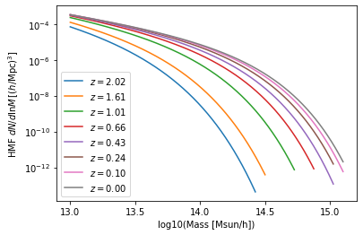
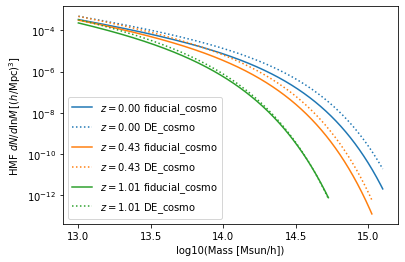

Tutorial
========

Learn how to use the Mira-Titan Universe HMF emulator.

.. code:: ipython3

    import numpy as np
    from matplotlib import pyplot as plt
    
    import MiraTitanUniverseHMFemulator
    
    print("Version", MiraTitanUniverseHMFemulator.__version__)

.. parsed-literal::

    Version 0.0.0

Initialize the emulator
-----------------------

This may take a few seconds: the code pre-computes a bunch of matrix
inversions (through Cholesky decomposition).

.. code:: ipython3

    HMFemu = MiraTitanUniverseHMFemulator.Emulator()

Input cosmology
---------------

Let’s define a set of cosmology parameter for which we want the HMF. In
case you are unsure about the parameters and their ranges, you can grab
that from the emulator instance we just created. Don’t worry, the
emulator will complain (with a useful error message) if it doesn’t like
your input cosmology.

.. code:: ipython3

    HMFemu.param_limits

.. parsed-literal::

    {'Ommh2': (0.12, 0.155),
     'Ombh2': (0.0215, 0.0235),
     'Omnuh2': (0, 0.01),
     'n_s': (0.85, 1.05),
     'h': (0.55, 0.85),
     'sigma_8': (0.7, 0.9),
     'w_0': (-1.3, -0.7),
     'w_a': (-1.73, 1.28),
     'w_b': (0.3, 1.3)}

Note about dark energy equation-of-state parametrization
~~~~~~~~~~~~~~~~~~~~~~~~~~~~~~~~~~~~~~~~~~~~~~~~~~~~~~~~

The emulator itself works in the space of :math:`(w_0, w_b)`, where
:math:`w_b = (-w_0 -w_a)^{1/4}` (see paper). The user is expected to
provide the parameters in the usual space of :math:`(w_0, w_a)` and the
code will handle the conversion for you!

.. code:: ipython3

    fiducial_cosmo = {'Ommh2': .3*.7**2,
                      'Ombh2': .022,
                      'Omnuh2': .006,
                      'n_s': .96,
                      'h': .7,
                      'w_0': -1,
                      'w_a': 0,
                      'sigma_8': .8,
                     }

Call the emulator
-----------------

It’s as easy as:

.. code:: ipython3

    res = HMFemu.predict(fiducial_cosmo)

Now let’s look at the output stored in the ``res`` dictionary. Each
(numerical) key corresponds to a redshift for which the emulator
computed the HMF. There’s a ``Units`` key, too.

.. code:: ipython3

    print(res.keys())

.. parsed-literal::

    dict_keys(['Units', 2.02, 1.61, 1.01, 0.656, 0.434, 0.242, 0.101, 0.0])

.. code:: ipython3

    print(res['Units'])

.. parsed-literal::

    log10_M is log10(Mass in [Msun/h]), HMFs are given in [h^2 Msun/Mpc^3]

So far, nothing too dramatic. Now let’s look into one of the redshift
outputs:

.. code:: ipython3

    print("Keys of res[0.0]:\t", res[0.0].keys())
    print("Redshift of res[0.0]:\t", res[0.0]['redshift'])
    print("Array of (log) masses:\t", res[0.0]['log10_M'])
    print("The emulated HMF\t", res[0.0]['HMF'])

.. parsed-literal::

    Keys of res[0.0]:	 dict_keys(['redshift', 'log10_M', 'HMF', 'wstar', 'wstar_covmat', 'PC_weight'])
    Redshift of res[0.0]:	 0.0
    Array of (log) masses:	 [13.      13.00075 13.0015  ... 15.09775 15.0985  15.09925]
    The emulated HMF	 [3.34203450e-04 3.33450191e-04 3.32698490e-04 ... 2.13904071e-12
     2.08848447e-12 2.03904633e-12]

This cries for a nice plot. Note that the emulator covers the HMF down
to about 1e-12, which corresponds to different masses at different
redshifts.

.. code:: ipython3

    for z in HMFemu.z_arr:
        plt.semilogy(res[z]['log10_M'], res[z]['HMF'], label='$z=%.2f$'%z)
    plt.xlabel('log10(Mass [Msun/h])')
    plt.ylabel('HMF $dN/d\lnM\,[h^2 M_\odot/\\mathrm{Mpc}^3]$')
    plt.legend()

.. parsed-literal::

    <matplotlib.legend.Legend at 0x10ac497b8>

OK, now we understand the basic concept. Let’s try another cosmology
with for dark energy just for fun.

.. code:: ipython3

    DE_cosmo = {'Ommh2': .3*.7**2,
                'Ombh2': .022,
                'Omnuh2': .006,
                'n_s': .96,
                'h': .6,
                'w_0': -1.3,
                'w_a': -1,
                'sigma_8': .8,
               }

.. code:: ipython3

    res_DE = HMFemu.predict(DE_cosmo)

.. code:: ipython3

    colors=['C%s'%i for i in range(3)]
    for i,z in enumerate([0.0, 0.434, 1.01]):
        plt.semilogy(res[z]['log10_M'], res[z]['HMF'], color=colors[i], label='$z=%.2f$ fiducial_cosmo'%z)
        plt.semilogy(res[z]['log10_M'], res_DE[z]['HMF'], color=colors[i], label='$z=%.2f$ DE_cosmo'%z, ls=':')
    plt.xlabel('log10(Mass [Msun/h])')
    plt.ylabel('HMF $dN/d\lnM\,[h^2 M_\odot/\\mathrm{Mpc}^3]$')
    plt.legend()

.. parsed-literal::

    <matplotlib.legend.Legend at 0x11bcb0da0>

Emulator uncertainty
--------------------

Under construction…

